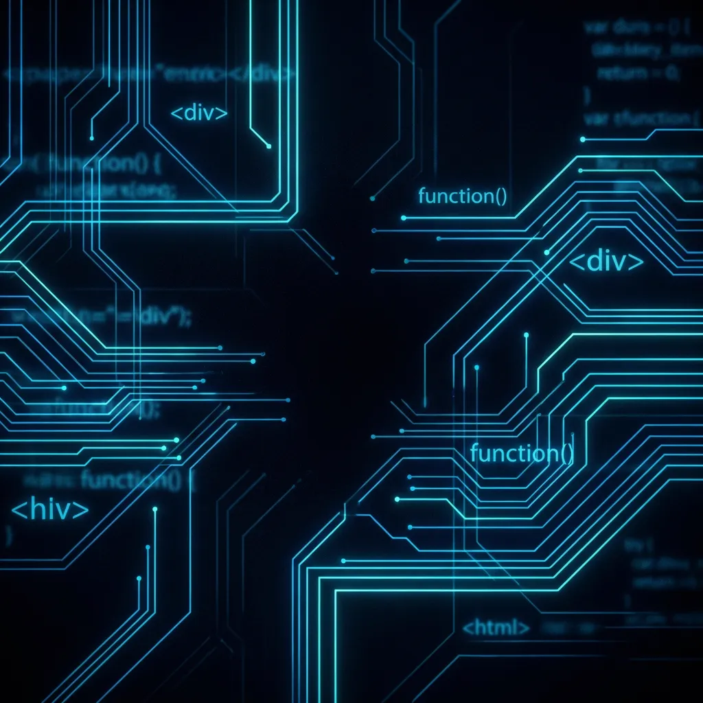

# Dalvi Consultancy

**Dalvi Consultancy** is a forward-thinking digital solutions agency specializing in high-performance web development, AI integration, and automated workflows. We transform complex constraints into elegant, scalable digital reality.

## 🚀 About Us

We bridge the gap between creative vision and technical execution. Our mission is to empower businesses with digital tools that are not just functional but "intuitively inevitable." From sleek corporate portfolios to complex RTO management systems, we ship software that works.

### Core Services
- **Web & App Development**: Full-stack solutions using modern frameworks (React, Next.js).
- **AI Chatbots & Agents**: Intelligent conversational interfaces for customer support and automation.
- **Hyperscale Automation**: Streamlining business processes with custom scripts and workflows.
- **Static Media & Design**: Premium visual assets and branding.

## 🛠 Tech Stack

We use a curated stack to ensure performance, security, and scalability:

- **Frontend**: HTML5, CSS3 (Custom/Tailwind), JavaScript (ES6+)
- **Backend**: Node.js, Python (FastAPI/Flask)
- **Deployment**: GitHub Pages, Vercel, Firebase
- **Tools**: FFmpeg (Media Optimization), Git

## 📂 Featured Projects

| Project | Description | Tech |
|---------|-------------|------|
| **[RTO Buddy](https://rtobuddy.dalvigroup.co.in)** | Digital RTO management system for vehicle registration and compliance. | Web Layout, Forms |
| **[Playverse](https://client.dalvigroup.co.in/playverse)** | Esports and gaming community platform. | React, Gaming UI |
| **[Dirt Shack](https://dirtshack.in)** | Premium off-road gear e-commerce store. | E-commerce, UX |
| **[SMPG](https://app.dalvigroup.co.in/smpg)** | Social Media Post Generator for automated content creation. | Automation, AI |
| **[Boundless Generosity](https://client.dalvigroup.co.in/boundlessgenerosity)** | Charity platform connecting donors with non-profits. | Payment Gateways |

## 🔗 Connect

- **Website**: [dalviconsultancy.github.io](https://dalviconsultancy.github.io/)
- **Email**: support@dalvigroup.co.in
- **GitHub**: [DalviConsultancy](https://github.com/DalviConsultancy)

---
*© 2024 Dalvi Consultancy. Building the future, pixel by pixel.*
